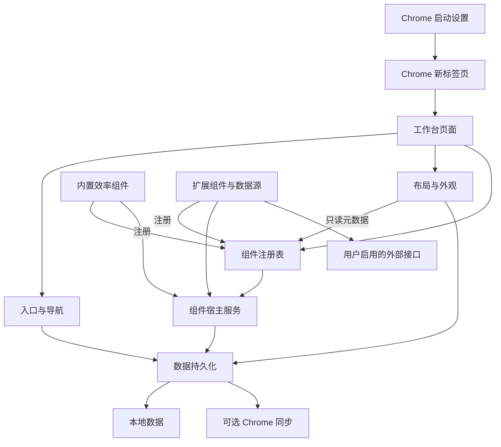

# 系统总体设计

> **created**: 2026-10-07 ｜ **last-change**: 2026-10-08 ｜ **status**: draft

<!-- @topic: SystemOverview -->

## 1. 简介

oh-my-tab 面向公众发布，将 Chrome 新标签页和浏览器启动页统一为个人工作台，整合导航、效率与视觉体验。仓库已有独立 HTML 交互原型及其验证记录，没有可加载的扩展、manifest.json 或正式构建工具链。首页交互与外观细节已于 2026-10-08 确认；整体架构、同步与深度扩展方案仍为讨论稿。

需求来源为本次讨论及初始化前的根 README，源文件 SHA-256 为 `5c7ea875cec1db4dbf63743dcbab21a51e8c185436974450bf9567f970e0233a`。原件已备份，根文件保留。本文件是需求基线和方案草案，不是实现或验收证据。

## 2. 索引

- 文档 ID：`DESIGN-SYS`；Topic：`SystemOverview`。
- [原始产品目标](../../../README.md)。
- [研发机器索引](../index.json)。
- [变更总账 (SystemOverview)](../change/index.json#SystemOverview)。

- [01-页面入口与导航.md](01-页面入口与导航.md)：新标签页和启动入口、网页搜索、常用链接与导航分组。
- [02-工作台布局与外观.md](02-工作台布局与外观.md)：组件自由布局、主题、壁纸、时钟与样式恢复。
- [03-效率组件.md](03-效率组件.md)：待办、便签、日历等内置组件的行为与独立状态。
- [04-数据保存与同步.md](04-数据保存与同步.md)：本地持久化、可选 Chrome 同步、容量边界与配置升级。
- [05-深度扩展与外部数据.md](05-深度扩展与外部数据.md)：外部数据源接入、权限与请求降级；组件注册契约见 06。
- [06-组件契约与注册.md](06-组件契约与注册.md)：组件契约、注册表、实例模型与宿主服务。

## 3. 规范

1. 已确认范围以用户选择与来源文档为依据；“建议”与“需确定”的细节尚未冻结。
2. 本文件负责产品边界、分层结构、模块职责与整体证据状态，通过模块边界与其他领域协作。
3. 后续卡片关联本文件与匹配 Topic，禁止以 README 作为 design_doc。
4. 文档状态 draft 不代表已完成开发；测试、真实 Chrome 运行、同步验证与发布结果分别记录。
5. 未决接口和技术选型确定后修订正文，再进入对应任务实施。

## 4. 设计内容

### 4.1 背景与定位

产品边界、分层结构、模块职责与整体证据状态。本次以现有需求文档建立清楚的领域边界，不从通用治理模板推断业务源码或运行环境。

### 4.2 目标与非目标

已确认目标：两个入口共用页面；同时提供导航、效率和氛围能力；支持自由布局与深度扩展；面向公众发布；采用本地保存和可选 Chrome 同步。

本次治理初始化不交付业务代码、商店发布或已验收的首版；不建立独立账号与云后端。首版具体范围、技术栈与最低 Chrome 版本尚未决定。

### 4.3 需求清单

| 编号 | 能力 | 需求或规划规则 |
| --- | --- | --- |
| SYS-01 | 统一入口 | 新标签页与启动页使用同一页面、布局与数据。 |
| SYS-02 | 组合能力 | 导航、效率组件与壁纸主题可以同时使用，也可以按需关闭。 |
| SYS-03 | 定制层次 | 布局编辑与 CSS、外部数据源、扩展组件分别具有清楚的配置入口。 |
| SYS-04 | 数据策略 | 本地保存为基础，同步轻量配置，个人内容与大资源的范围单独设计。 |
| SYS-05 | 公开发布 | 安装引导、权限说明、兼容性与配置升级属于发布设计范围。 |
| SYS-06 | 首页交互 | 时间与日期 → 网页搜索 → 网站；默认无效率组件，支持时间收起、网站右键管理及长按排序。 |
| SYS-07 | 首页外观 | 自定义背景、无框无描边时间、时间与搜索框独立调节及本地保存。 |

非功能方向沿用 README：快速打开、本地优先、权限范围清楚、独立组件失败可降级。量化性能和资源预算仍需首版方案确定，不填入未经验证的指标。

### 4.4 功能行为与交互

建议页面启动时先读取本地状态并显示工作台，再加载可选同步和外部数据。用户编辑布局或内容后交由持久化模块保存；公开版本使用可用的默认配置，高级能力集中在设置入口。外部组件失败只影响自身展示。

**首页设计确认记录**

2026-10-08，用户在时间与搜索外观设置的 demo 更新后确认：“确认，先把这些设计细节落到文档中”。本轮确认覆盖当前首页的布局、交互与可调外观，作为后续实现依据；不据此替代正式 Chrome 运行、同步验证或发布验收。整体文档保留 draft，各模块明确已确认范围与未决技术项。

| 已确认范围 | 行为 | 规则所在文档 |
| --- | --- | --- |
| 默认首页 | 时间与日期、网页搜索、常用网站依次排列，时间与搜索默认居中；组件自行添加 | DESIGN-LAYOUT 4.4 |
| 时间 | 无背景框、无白边、默认无阴影；点击收起/恢复；可调字体、字号、字重、位置及日期/秒数 | DESIGN-LAYOUT 4.4、4.6 |
| 搜索 | 默认 Google，可切换引擎；搜索网页；位置、宽度、透明度与背景模糊可调 | DESIGN-NAV 4.4；DESIGN-LAYOUT 4.6 |
| 网站 | 名称/HTTP(S) 地址可编辑，自动图标及首字符回退，统一连续圆角，右键菜单与长按排序 | DESIGN-NAV 4.4、4.6 |
| 背景 | 默认材质、纯色、本地图片，裁切位置/遮罩/模糊可调；背景文字自适应 | DESIGN-LAYOUT 4.4 |
| 组件 | 默认不放置，添加后展示，移除保留内容 | DESIGN-WIDGETS 4.4 |
| 设置与数据 | 即时预览、自动本地保存，时间与搜索分别恢复默认，保留其他内容 | DESIGN-LAYOUT 4.6；DESIGN-DATA 4.4、4.6 |

正式默认材质、首版组件完整范围、前端工具链、CSS 定制、Chrome 存储与同步契约仍待设计。原型示例网站与组件限额不自动成为正式产品默认内容或容量契约。

**组件可扩展架构确认记录**

2026-10-08，用户确认组件可扩展架构方向："确认，更新不允许破坏当前项目的文档治理流程和规范"。本轮确认覆盖：数据模型按多实例设计、"每类型单实例"为首版交互政策、组件区采用 12 列栅格流式布局、组件契约收拢为单一来源并修正分层依赖方向。契约具体字段未冻结，详见 [06-组件契约与注册.md](06-组件契约与注册.md)。

**技术栈与首版范围决策记录（2026-10-08）**

2026-10-08，用户完成下一阶段关键技术决策：
1. **前端技术栈与构建工具链**：选定 **React 18 + TypeScript + Vite + Tailwind CSS**，与现有原型 JSX 结构平滑对接；打包构建产物严格强制隔离输出至根目录 `local/dist/`，遵守构建隔离红线。
2. **首版 (v0.1.0) 内置效率组件范围**：定调为 **今日待办 (Todo)**、**随手便签 (Notes)**、**专注计时 (Focus Timer)**；撕页日历暂缓至下个里程碑。
3. **本地与同步存储技术方案**：选定 **原生 Chrome Storage (`local` + `sync`) 搭配原生 IndexedDB**（轻量配置与状态走 Chrome API，大图壁纸进 IndexedDB，零重型外部依赖）。

### 4.5 建议架构与 Topic

主题锚点为 `SystemOverview`。

建议架构，尚未实现：

页面层负责展示，领域模块负责行为，持久化与数据源适配负责浏览器 API 和网络 I/O。布局层只消费组件注册表的元数据，不依赖具体组件实现，新增组件不需要修改布局代码；内置组件与扩展组件对注册表等价，契约见 [06-组件契约与注册.md](06-组件契约与注册.md)。具体前端框架与目录结构尚未选定。

#### 功能模块矩阵

| 模块 | Topic | 设计文件 | 职责边界 | 状态 |
| --- | --- | --- | --- | --- |
| 入口与导航 | EntryNavigation | [01-页面入口与导航.md](01-页面入口与导航.md) | 页面接入、链接与搜索 | draft |
| 布局与外观 | WorkspaceAppearance | [02-工作台布局与外观.md](02-工作台布局与外观.md) | 组件位置、尺寸、主题与 CSS | draft |
| 效率组件 | ProductivityWidgets | [03-效率组件.md](03-效率组件.md) | 待办、便签、日历与组件内容 | draft |
| 数据与同步 | DataPersistenceSync | [04-数据保存与同步.md](04-数据保存与同步.md) | 本地持久化、同步与配置迁移 | draft |
| 深度扩展 | ExtensionDataSources | [05-深度扩展与外部数据.md](05-深度扩展与外部数据.md) | 外部数据接入、权限与请求降级 | draft |
| 组件契约与注册 | WidgetContract | [06-组件契约与注册.md](06-组件契约与注册.md) | 组件清单、实例模型、宿主服务与状态分类 | draft |

#### 技术栈决策状态

| 层次 | 当前依据 | 决策状态 |
| --- | --- | --- |
| 浏览器平台 | Google Chrome，新标签页与启动页 | 已确认目标 |
| 扩展规范 | Manifest V3、newtab 覆盖 | 建议方案，待实际加载验证 |
| 前端框架、语言与构建工具 | React 18 + TypeScript + Vite + Tailwind CSS | 已选定，构建强制输出 local/dist/ |
| 本地与同步存储 | 原生 Chrome Storage (local/sync) + 原生 IndexedDB | 已选定，零外部重型依赖 |
| 首版效率组件范围 | 今日待办 (Todo)、随手便签 (Notes)、专注计时 (Focus Timer) | 已定调，撕页日历暂缓至下一阶段 |
| 独立账号与后端 | 本地优先与可选 Chrome 同步方案 | 不在当前规划内 |

### 4.6 详细规则与逻辑契约

模块边界以职责划分：导航管理链接与搜索；布局管理位置、大小和主题；效率模块管理待办、便签与日历行为；持久化模块提供保存、加载和同步边界；扩展模块管理外部数据源与权限；契约模块管理组件清单、实例模型与宿主服务。逻辑接口尚未冻结，不将这些职责描述视为已存在的源码 API。

#### 变更演进索引

| 编号 | 类型 | 简介 | 规则演进 |
| --- | --- | --- | --- |

当前无实际 C/T 卡；初始化来源由本文与 Git 工作区记录追溯。

### 4.7 扩展、异常与实施前决策

Manifest V3 与 chrome_url_overrides.newtab 为建议平台接入方案。启动页采用用户选择启动时打开新标签页的方案，保留其他启动设置。无痕新标签页不在覆盖范围。组件逻辑建议随扩展打包，外部接口提供数据；权限按功能说明。

首页视觉交互基线与组件可扩展架构方向已确认。实施前仍需确定首版完整范围与实施顺序、默认材质、技术栈、组件契约字段与 settingsSchema 格式（见 06）、同步冲突规则、同机多窗口实时一致性、界面文案与日期/时区的国际化方案、性能预算、最低 Chrome 版本和发布验收标准。原型静态 HTTP 预览服务仅用于设计查看，不表示扩展需要后端端口或数据库。

### 4.8 后续验证与参考资料

2026-10-07 的 HTML 原型完成 35 项配置/背景回归及内置浏览器交互检查，记录见 `local/homepage-artifact-check.json`、`local/homepage-minimal-browser-check.json`、`local/homepage-appearance-browser-check.json` 和 `local/deploy_report.md`。2026-10-08 的用户确认用于设计落文，不追加运行验收结论。

后续正式验收覆盖两个入口、配置保存与升级、离线使用、外部接口降级、布局恢复、CSS 恢复和可选同步。真实 Chrome 验证与商店发布仍未执行，不能由 HTML 原型测试代替。

- [产品目标与官方资料入口](../../../README.md)。
- [Chrome 官方文档 1](https://developer.chrome.com/docs/extensions/develop/ui/override-chrome-pages)
- [Chrome 官方文档 2](https://developer.chrome.com/docs/webstore/program-policies/mv3-requirements)
