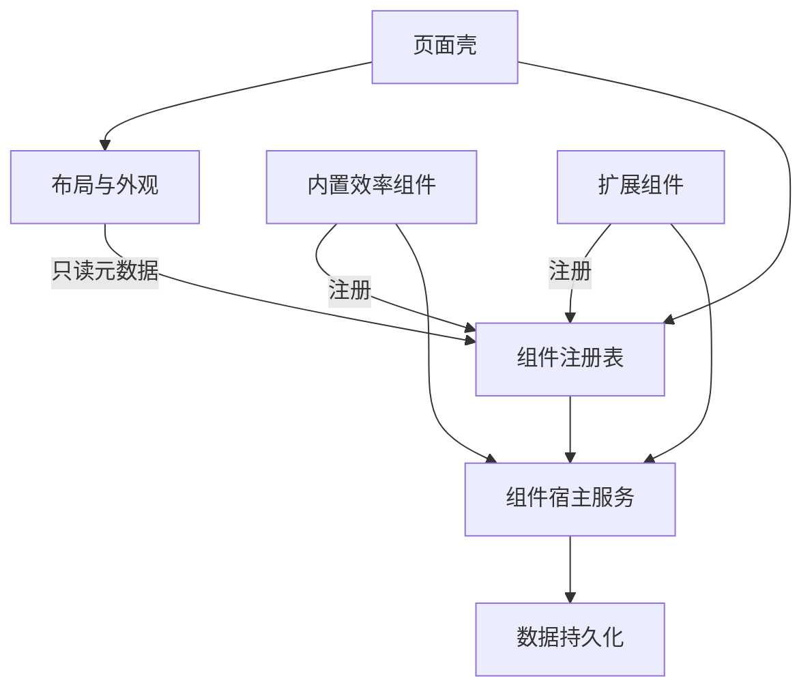

# 组件契约与注册设计方案

> **created**: 2026-10-08 ｜ **last-change**: 2026-10-08 ｜ **status**: draft

<!-- @topic: WidgetContract -->

## 1. 简介

本文是组件契约、注册表、实例模型与宿主服务的单一设计来源，收拢此前散落在效率组件与深度扩展文档中的契约描述。2026-10-08 用户确认组件可扩展架构方向，原话："确认，更新不允许破坏当前项目的文档治理流程和规范"。该确认覆盖架构方向：数据模型按多实例设计、"每类型单实例"为首版交互政策、组件区采用栅格流式布局、契约描述收拢为单一来源；不表示契约字段已冻结或已有实现。

需求来源为本次讨论；内置组件业务行为、布局算法与数据源协议仍分别由对应模块文档承担。本文件是方案草案，不是实现或验收证据。

## 2. 索引

- 文档 ID：`DESIGN-WIDGET-CONTRACT`；Topic：`WidgetContract`。
- [原始产品目标](../../../README.md)。
- [研发机器索引](../index.json)。
- [变更总账 (WidgetContract)](../change/index.json#WidgetContract)。

- [00-系统总体设计.md](00-系统总体设计.md)：产品边界、分层结构、模块职责与整体证据状态。
- [02-工作台布局与外观.md](02-工作台布局与外观.md)：组件区栅格形态与 LayoutItem 语义。
- [03-效率组件.md](03-效率组件.md)：内置组件行为与添加/移除交互。
- [04-数据保存与同步.md](04-数据保存与同步.md)：组件内容的存储分类、同步与导出边界。
- [05-深度扩展与外部数据.md](05-深度扩展与外部数据.md)：外部数据源描述符、权限与请求降级。

## 3. 规范

1. 已确认范围以用户选择与来源文档为依据；“建议”与“需确定”的细节尚未冻结。
2. 本文件负责组件清单、实例模型、宿主服务与统一状态分类；组件业务行为、布局算法与数据源协议分别由对应模块承担。
3. 后续卡片关联本文件与匹配 Topic，禁止以 README 作为 design_doc。
4. 文档状态 draft 不代表已完成开发；测试、真实 Chrome 运行、同步验证与发布结果分别记录。
5. 未决接口和技术选型确定后修订正文，再进入对应任务实施。

## 4. 设计内容

### 4.1 背景与定位

组件契约、注册表、实例模型与宿主服务的单一来源。此前"组件定义/实例/内容三分"与"组件声明字段"分别写在效率组件和深度扩展文档中，两处段落级描述易发散；自本文建立后，其余模块只引用不重复定义。

### 4.2 目标与非目标

目标：内置组件与扩展组件共享同一份可验证契约；新增组件不修改壳层与布局代码；数据模型自第一天起兼容多实例；单组件失败或未知类型不影响其他内容。

非目标：首版不开放多实例界面（数据模型预留）；不建立组件市场、远程脚本安装器或任意代码解释器；不将字段描述视为已存在的源码 API；iframe 沙箱与远程组件仅作远期预留，不在首版设计。

### 4.3 需求清单

| 编号 | 能力 | 需求或规划规则 |
| --- | --- | --- |
| WCO-01 | 统一注册 | 内置与扩展组件通过同一注册表登记元数据；布局层与添加入口只消费注册表。 |
| WCO-02 | 实例模型 | 数据层支持多实例；首版“每类型单实例”为添加入口的交互政策，不进数据结构。 |
| WCO-03 | 宿主服务 | 组件经注入上下文使用存储、调度、网络与通知服务，按能力声明授权。 |
| WCO-04 | 声明式配置 | 组件配置项以 settingsSchema 声明并由通用表单渲染；每组件可独立恢复默认。 |
| WCO-05 | 向前兼容 | 配置中出现未知类型时渲染占位卡片并保留数据，不删除、不阻塞。 |
| WCO-06 | 状态分类 | 统一加载、空、错误、离线、未授权、配额超限与类型未知七类状态及卡片外壳。 |

非功能方向沿用 README：快速打开、本地优先、权限范围清楚、独立组件失败可降级。量化性能和资源预算仍需首版方案确定，不填入未经验证的指标。

### 4.4 功能行为与交互

**确认记录（2026-10-08）**

用户确认组件可扩展架构方向："确认，更新不允许破坏当前项目的文档治理流程和规范"。覆盖：多实例数据模型与单实例交互政策、组件区栅格流式布局定调（见布局设计）、契约单一来源与分层依赖方向修正。契约具体字段、settingsSchema 格式与迁移钩子签名不在本轮确认范围。

添加组件入口从注册表元数据生成可选列表；已存在可见实例的类型置灰为首版政策，数据模型不阻止第二实例。移除实例只把展示状态置为隐藏，内容按实例命名空间原地保留；再次添加重新点亮既有实例并恢复内容，与已确认的"移除保留内容"一致。组件设置面板由通用渲染器按 settingsSchema 生成，与时间/搜索设置面板同族交互，支持每组独立恢复默认。卡片外壳（标题、菜单、移除入口、状态提示）由页面壳统一提供，组件只渲染内容区。

### 4.5 建议架构与 Topic

主题锚点为 `WidgetContract`。

建议架构，尚未实现：

布局层不依赖任何具体组件实现，新增组件零布局改动；内置与扩展组件对注册表等价。时间与搜索首版保持页面壳内的固定区域，契约字段设计预留将其表达为系统组件（如 `core.clock`）的可能，不堵死后续演进。

### 4.6 详细规则与逻辑契约

**组件清单 WidgetManifest（建议字段，未冻结）**

| 字段 | 类型（示意） | 说明 |
| --- | --- | --- |
| `typeId` | string | 命名空间隔离：`core.*` 内置 / `ext.*` 扩展 |
| `contractVersion` | number | 契约全局版本，兼容判断依据 |
| `contentVersion` | number | 该类型内容 schema 版本，配迁移钩子 |
| `displayName` / `icon` | string | 展示名与图标，预留国际化 key |
| `defaultSpan` / `supportedSpans` | number / number[] | 12 列栅格默认跨度与可用跨度；窄窗口按此降档 |
| `minContentHeight` | number | 最小内容高度 |
| `capabilities` | object | network、tick、notify、storage 能力声明，作为按需授权依据 |
| `settingsSchema` | SettingField[] | 声明式配置项，通用表单渲染器消费 |
| `syncPolicy` | enum | `never` / `optIn` / `default`，声明内容是否进入同步与导出 |
| `dataSource` | descriptor? | 外部数据源声明，字段由深度扩展模块定义 |
| `mount` / `migrate` | hook | 挂载钩子接收注入的宿主上下文；内容版本迁移钩子 |

**组件实例 WidgetInstance（结构建议，未冻结）**

| 字段 | 说明 |
| --- | --- |
| `instanceId` | 稳定实例标识，创建后不随类型或展示变化 |
| `typeId` | 关联组件类型 |
| `settings` | 按 settingsSchema 校验后的配置值 |
| `visible` | 展示状态；“移除”即置为隐藏，内容保留 |

内容按 `widgets/<instanceId>/content` 命名空间存储，与展示状态物理分离。与已确认交互的映射：同类型存在隐藏实例时，再次添加重新点亮该实例并恢复内容；添加列表对"存在可见实例"的类型置灰仅是交互层判断；"展示列表与业务内容分别管理"由此在结构上成立，未来放开多实例只需调整置灰规则并创建新 `instanceId`，无需数据迁移。

**宿主服务与状态分类**

| 服务 | 职责 | 对应组件示例 |
| --- | --- | --- |
| `host.storage` | 按实例命名空间的键值/大容量存储，配额跟踪与超限反馈 | 待办、便签 |
| `host.scheduler` | 统一时间调度：秒/分/日粒度与跨刷新恢复（截止时间戳加重算） | 日历翻日、专注计时 |
| `host.net` | 声明式数据源请求：在途去重、取消、缓存 TTL、页面不可见暂停 | 联网组件 |
| `host.notify` | 通知能力，按能力声明申请权限 | 专注计时 |

组件状态统一分为加载中、空、错误、离线、未授权、配额超限、类型未知七类；类型未知由页面壳渲染占位卡片并保留数据，其余状态由卡片外壳统一呈现，组件提供状态内容。

**四类候选组件的契约覆盖检查（设计自检，非实现证据）**

| 组件 | tick | storage | network | notify | syncPolicy |
| --- | --- | --- | --- | --- | --- |
| 撕页日历 | day | kv | – | – | optIn |
| 专注计时 | second（可见时） | kv（截止时间戳） | – | 需要 | never |
| 今日待办 | – | kv | – | – | optIn |
| 随手便签 | – | kv | – | – | optIn |

四个候选全部落在契约能力集内，且各自至少依赖一项宿主服务，说明能力声明粒度与首版组件范围匹配；候选清单本身仍不冻结为正式首版组件。

**与数据模块的映射**

| 数据 | 归类（数据设计 4.6） | 同步与导出 |
| --- | --- | --- |
| 实例列表（instanceId/typeId/settings/visible/span/order） | 轻量配置 | 同步候选，进导出 |
| `widgets/<instanceId>/content` | 个人内容 | 按 syncPolicy 逐组件决定 |
| 未知 typeId 的实例与内容 | 原样保留 | 照常同步，渲染占位卡 |

#### 变更演进索引

| 编号 | 类型 | 简介 | 规则演进 |
| --- | --- | --- | --- |

当前无实际 C/T 卡；初始化来源由本文与 Git 工作区记录追溯。

### 4.7 扩展、异常与实施前决策

契约字段命名、TypeScript 接口、settingsSchema 具体格式、dataSource 描述符与迁移钩子签名尚未冻结，冻结前不进入实现。外部组件分发沿用深度扩展模块"随扩展打包"的默认建议；iframe 沙箱与 postMessage 通道仅作远期预留，启用前需单独安全设计。契约应配套一致性测试 harness：以模拟宿主服务挂载组件，断言生命周期与七类状态，作为新组件接入的准入回归。

需确定：字段冻结范围与时点、settingsSchema 格式、多实例界面放开策略、时间/搜索是否在后续版本表达为系统组件、harness 随测试规范的落地方式。

### 4.8 后续验证与参考资料

当前无业务实现，无运行验收证据。后续按以下可观察标准核验：添加列表来自注册表元数据；置灰逻辑不阻止数据层第二实例；移除/恢复不丢内容；未知类型占位且数据保留；七类状态呈现一致；每组件恢复默认不影响其他数据；契约 harness 覆盖全部内置组件。

- [产品目标与官方资料入口](../../../README.md)。
- [Chrome 扩展存储 API](https://developer.chrome.com/docs/extensions/reference/api/storage)
- [Chrome alarms API](https://developer.chrome.com/docs/extensions/reference/api/alarms)
- [Chrome notifications API](https://developer.chrome.com/docs/extensions/reference/api/notifications)
